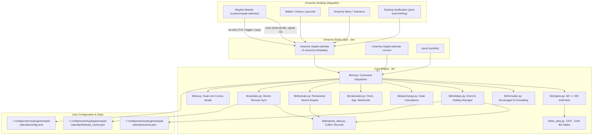

# Specification: Nepali Calendar Plugin for Omarchy (`omarchy-nepali-calendar`)

## 1. Executive Summary

This specification defines the complete architecture, data models, astronomical algorithms, interactive user experience, and integration patterns for the **Nepali Calendar (Bikram Sambat / वि.सं.) Plugin** for the **Omarchy** desktop environment (Arch Linux + Hyprland + Waybar + Walker).

The plugin implements Omarchy's **recommended hybrid architecture**:
1. **Omarchy Native CLI & Glue (Bash 5)**: Standard `omarchy-*` commands conforming to Omarchy style guidelines, metadata headers, Walker dmenu scripts, and Waybar runners.
2. **Offline Calculation Engine & Interactive TUI (Pure Python 3 StdLib)**: High-speed, zero-dependency calendar arithmetic, astronomical Kathmandu solar Panchanga, government office status tracking, age/weekend calculators, 3,280+ festival search engine, fail-safe remote updater, and curses-based terminal calendar.

---

## 2. Architecture & Design Principles



---

## 3. Neovim Plugin (`neovim-nepali-calendar`) Parity Matrix

The Omarchy Nepali Calendar plugin ports 100% of the capabilities from the reference Neovim plugin (`neovim-nepali-calendar`) and augments them with native Linux/Hyprland desktop integrations:

| Capability / Feature | Neovim Plugin (`neovim-nepali-calendar`) | Omarchy Plugin (`omarchy-nepali-calendar`) | Status |
| :--- | :--- | :--- | :--- |
| **BS $\leftrightarrow$ AD Date Conversion** | Lua engine (1975–2100 BS) | Python 3 engine (`lib/engine.py`) | ✅ Full Parity |
| **Official BS Month Days Data** | 126-year day-count tables | Exact 126-year table in `lib/bs_data.py` | ✅ Full Parity |
| **Sunday-First Week Format** | `आइत` to `शनि` (7 columns) | Sunday in Col 1, Saturday in Col 7 | ✅ Full Parity |
| **Devanagari Numerals & Months** | `०-९`, १२ महिना, ७ बार | Configurable (`ne` / `en`) formatting | ✅ Full Parity |
| **3,280+ Bundled Festivals** | BS 2075–2083+ dataset | 3,287+ records in `lib/festivals_data.py` | ✅ Full Parity |
| **Romanized Search & Synonyms** | `dashain`, `tihar`, `teej`, etc. | Smart synonym expansion in `lib/festivals.py` | ✅ Full Parity |
| **Kathmandu Solar Panchanga** | Sunrise, Sunset, Day Length, Rashi, Rahu | Exact solar calculations in `lib/panchanga.py` | ✅ Full Parity |
| **Live NPT Clock & Office Status** | UTC+5:45 clock, `[खुल्ला]` / `[बन्द]` | Real-time tracker in `lib/calculator.py` | ✅ Full Parity |
| **BS Age & Countdown Calculator** | Completed Y/M/D, next birthday | Full age calculation & birthday countdown | ✅ Full Parity |
| **Date Shifting Math** | $\pm N$ days shifting | Fast BS date shifting CLI & API | ✅ Full Parity |
| **Long Weekend Detector** | $\ge 2$ consecutive days off | Streak analyzer in `lib/calculator.py` | ✅ Full Parity |
| **Visual Date Range Selection** | Vim visual mode (`v` / `V`) | Curses visual selection (`v` / `V`) in TUI | ✅ Full Parity |
| **In-App Search Modal** | Float buffer search modal | In-app modal (`/` / `s`) in TUI | ✅ Full Parity |
| **In-App Date Converter** | Float converter dialog | In-app modal (`c`) in TUI | ✅ Full Parity |
| **Fail-Safe Remote Sync** | Remote TSV sync with backup | Atomic TSV updater with rollback protection | ✅ Full Parity |
| **Multi-Line Event Display** | Single / wrapped lines | Dedicated multi-line card layouts | 🌟 Enhanced |
| **Waybar Status Bar Integration** | N/A (Neovim only) | Live JSON stream with signal 11 reload | 🚀 New Desktop Feature |
| **Walker / Dmenu Launcher** | N/A (Neovim only) | Interactive dmenu runner with actions | 🚀 New Desktop Feature |
| **Desktop Login Briefing** | N/A (Neovim only) | `post-boot.d` notification briefing hook | 🚀 New Desktop Feature |
| **Clipboard Support** | Vim registers (`"+y`) | Native Wayland (`wl-copy`) & X11 (`xclip`) | 🚀 New Desktop Feature |

---

## 4. Directory & File Structure

```
omarchy-plugins/
├── omarchy-nepali-calendar/
│   ├── plugin.toml                     # Omarchy plugin manifest & metadata
│   ├── install.sh                      # Non-destructive installer
│   ├── uninstall.sh                    # Clean uninstaller
│   ├── default-config.toml             # Default user configuration
│   ├── default-events.json             # Default custom events template
│   ├── main.py                         # Top-level Python CLI runner
│   ├── bin/
│   │   ├── omarchy-nepali-calendar     # Main Bash CLI (with Omarchy metadata headers)
│   │   ├── omarchy-nepali-calendar-convert # Quick conversion CLI
│   │   └── npcal                       # Short alias wrapper
│   ├── lib/
│   │   ├── __init__.py
│   │   ├── bs_data.py                  # Verified month day-count tables (1975-2100 BS)
│   │   ├── engine.py                   # AD <-> BS arithmetic & date math
│   │   ├── formatter.py                # Devanagari numerals & text formatter
│   │   ├── festivals_data.py           # Bundled 3,287+ festival & tithi records (2075-2083+ BS)
│   │   ├── festivals.py                # Romanized search engine & synonym mapping
│   │   ├── panchanga.py                # Kathmandu solar calculations (Sunrise, Sunset, Rahu, Rashi)
│   │   ├── calculator.py               # Nepal clock, office status, age & weekend calculators
│   │   ├── holidays.py                 # Unified holiday and custom event manager
│   │   ├── updater.py                  # Atomic remote TSV synchronizer & backup protection
│   │   ├── config.py                   # TOML config loader/writer
│   │   ├── cli.py                      # Python CLI dispatcher
│   │   └── tui.py                      # Interactive dual-line curses calendar modal
│   ├── waybar/
│   │   ├── nepali-calendar.sh          # Waybar JSON generator script
│   │   ├── module.jsonc                # Waybar module definition
│   │   └── style.css                   # Waybar CSS styling
│   ├── walker/
│   │   └── nepali-calendar-walker.sh   # Walker dmenu quick-action script
│   ├── hooks/
│   │   └── post-boot.d/
│   │       └── nepali-calendar-briefing.sh # Morning/login briefing hook
│   └── tests/
│       ├── __init__.py
│       └── test_engine.py              # Unit tests covering all 7 modules
├── SPEC.md                             # This technical specification
└── README.md                           # Repository overview & quickstart
```

---

## 5. Core Capabilities & Mathematical Models

### 5.1 Bikram Sambat Engine & Epoch Anchor
- **Supported Range:** **1975 BS to 2100 BS** (1918 AD to 2044 AD).
- **Epoch Anchor:** `1975-01-01 BS` $\leftrightarrow$ `1918-04-13 AD` (Saturday / शनिबार).
- **Accuracy:** Day-exact month lengths derived from official Nepal Government gazettes.
- **Conversion Invariance:** Round-trip conversion $BS \to AD \to BS$ produces zero drift across all 45,985 calendar days.

### 5.2 Kathmandu Solar Panchanga
Calculates real-time solar events for Kathmandu ($27.7172^\circ\text{ N}, 85.3240^\circ\text{ E}$):
- **Sunrise & Sunset Times**: Computed via solar declination ($\delta$) and hour angle ($\omega_0$) formula:
  $$\cos(\omega_0) = -\tan(\phi) \cdot \tan(\delta)$$
- **Day Length**: Total duration of daylight formatted as $X\text{h } Y\text{m}$.
- **Sun Sign (राशि - Rashi)**: Solar zodiac transit for the month (मेष / Aries through मीन / Pisces).
- **Rahu Kaal (राहु काल)**: 90-minute daily planetary obstacle window mapped by weekday (e.g. Sunday 16:30–18:00, Monday 07:30–09:00, etc.).
- **Udaya Tithi (उदय तिथि)**: Daily lunar phase extracted from the verified astronomical calendar dataset.

### 5.3 Live Nepal Clock & Government Office Status
- **NPT Offset**: Fixed $\text{UTC} + 5:45$.
- **Local Delta**: Time difference relative to the user's local system clock (e.g. `+9h 45m`).
- **Government Office Status**:
  - `[खुल्ला / Open]`: Sunday–Thursday 10:00 AM – 5:00 PM (Winter: 4:00 PM), Friday 10:00 AM – 3:00 PM.
  - `[बन्द / Closed]`: Outside office hours, Saturdays, and official public holidays.

### 5.4 Age & Date Math Calculator
- **Precise BS Age**: Computes completed years, months, and days, total days lived, and birth weekday.
- **Next Birthday Countdown**: Days remaining until the next birthday anniversary in Bikram Sambat.
- **Date Shifter**: Fast $\pm N$ day shift arithmetic on Bikram Sambat dates.
- **Long Weekend Detector**: Analyzes a month for consecutive streaks of holidays + Saturdays $\ge 2$ days for vacation planning.

### 5.5 Festival Search Engine
- **Database**: 3,287 daily records spanning BS 2075 through 2083+ (April 2018 AD to April 2027 AD).
- **Synonym & Transliteration Search**: Expands Romanized queries into Nepali terms:
  - `dashain` $\to$ `दशैं`, `दशमी`, `विजया`, `घटस्थापना`, `फूलपाती`, `महाअष्टमी`, `महानवमी`
  - `tihar` / `deepawali` $\to$ `तिहार`, `दिपावली`, `लक्ष्मी`, `भाइटीका`, `गोवर्धन`, `म्ह`
  - `teej` $\to$ `तीज`, `हरितालिका`, `दरखाने`, `ऋषिपञ्चमी`
  - `shivaratri` $\to$ `शिवरात्री`, `महाशिवरात्री`
  - `holi` $\to$ `होली`, `फागु`
  - `lhosar` $\to$ `ल्होसार`, `सोनाम`, `ग्याल्पो`, `तमु`
- **Priority Ranking**:
  1. Upcoming events in current calendar year.
  2. Past events in current calendar year.
  3. Future years chronologically.
  4. Past years chronologically.

### 5.6 Fail-Safe Remote Sync
- **Remote Source:** `https://raw.githubusercontent.com/pradhyu/mac-nepali-calendar/main/Sources/NepaliCalendar/Resources/festivals.tsv`
- **Cache & Backup Protection:**
  - Synchronizes to local cache: `~/.config/omarchy/plugins/nepali-calendar/festivals_cache.json`.
  - Maintains fallback backup: `festivals_backup.json`.
  - Aborts update if remote payload contains $< 100$ records to guard against network or schema corruption.

---

## 6. Multi-Line Event Formatting Specification

Events and festivals are formatted as multi-line cards across both CLI and TUI:

### 6.1 CLI Multi-Line Card Structure (`npcal events`)
```
━━━━━━━━━━━━━━━━━━━━━━━━━━━━━━━━━━━━━━━━━━━━━━━━━━━━
  🌸 आगामी चाडपर्वहरू (Upcoming Festivals)
━━━━━━━━━━━━━━━━━━━━━━━━━━━━━━━━━━━━━━━━━━━━━━━━━━━━

  📅 २०८३ भदौ २२ (Sep 07, 2026) • सोमबार [आज / Today]
  ├─ 🌕 एकादशी
  └─ 🏷️  [तपाईंको कार्यक्रम]

  📅 २०८३ भदौ २४ (Sep 09, 2026) • बुधबार [२ दिन बाँकी]
  ├─ 🔴 हरितालिका तीज व्रत
  └─ 🏷️  सार्वजनिक विदा (Public Holiday)
```

### 6.2 TUI Multi-Line Event Layout (`npcal tui`)
- The TUI side/bottom panel allocates vertical space for multiple stacked entries per day.
- If multiple events occur on the selected date or visual range:
  - Line 1: `✨ [Festival Name]` (highlighted in cyan/gold)
  - Line 2: `🔴 सार्वजनिक विदा (Public Holiday)` (highlighted in red)
  - Line 3: `🌙 [Lunar Tithi]` (subtle white/grey)
  - Line 4: `📌 [Custom User Event]` (highlighted in green)

---

## 7. User Interface Specifications

### 7.1 Interactive Curses TUI Modal (`npcal tui`)

- **Header Banner**: Live Nepal Time (NPT), Office Status (`[खुल्ला]` / `[बन्द]`), and Local Time Delta.
- **Month Header & Progress**: Month name, BS year, Gregorian span, and month elapsed progress bar (`[████████░░] 70%`).
- **Weekday Grid**: `आइत` through `शनि` (with Saturday highlighted in red).
- **Dual-Line Day Cards**:
  - Top Line: Bold Nepali numeral (`२२*` with `*` indicating public holiday).
  - Bottom Line: Subtle Gregorian day subscript in parentheses `(7)`.
- **Multi-Line Event Details**: Stacked, color-coded rows for every festival, tithi, and public holiday on the selected day.
- **Panchanga Card**: Displays Sunrise, Sunset, Day length, Rashi, Rahu Kaal, and Tithi.
- **Visual Range Selection (`v` / `V`)**: Select custom day spans or full weeks to view and copy multi-day events.
- **In-App Search Modal (`/` or `s`)**: Instant live search modal with direct numeric jump (1–6).
- **In-App Date Converter (`c`)**: Convert any date and jump directly to it without leaving the TUI.
- **In-App Long Weekend View (`W`)**: Toggle long weekend streaks list.
- **In-App Help Dialog (`?`)**: Full categorized keybinding reference overlay.

### 7.2 Keybinding Reference

| Key | Action |
| :--- | :--- |
| `h` / `l` / `←` / `→` | Previous / Next Day |
| `j` / `k` / `↓` / `↑` | Next / Previous Week (7 days) |
| `n` / `p` / `]` / `[` | Next / Previous Month |
| `N` / `P` / `L` / `H` / `}` / `{` | Next / Previous Year |
| `t` / `T` | Jump to Today |
| `v` | Toggle custom visual day range selection |
| `V` | Select entire week (Sunday–Saturday) |
| `/` or `s` | Open festival search modal |
| `c` | Open in-app date converter dialog |
| `W` | Toggle long weekend streaks view |
| `y` | Copy selected date or date range to clipboard |
| `yi` / `Y` | Copy ISO date (`YYYY-MM-DD`) to clipboard |
| `Tab` | Toggle language (`नेपाली` $\leftrightarrow$ `English`) |
| `u` | Synchronize latest festivals from remote |
| `?` | Open keybindings help dialog |
| `q` / `Esc` | Close popup / Exit visual mode |

---

## 8. CLI Command Reference (`npcal` / `omarchy-nepali-calendar`)

| Command | Arguments / Flags | Description | Example Output |
| :--- | :--- | :--- | :--- |
| `npcal` | *none* | Show current month calendar grid | 7-column calendar grid in terminal |
| `npcal today` | `[--lang ne\|en] [--format FMT] [--tz local\|npt]` | Print today's formatted BS date | `सोमबार, २२ भदौ २०८३ (एकादशी)` |
| `npcal cal` | `[month] [year] [--lang ne\|en]` | Display calendar for specific month/year | Calendar grid for specified month |
| `npcal convert` | `<date> [--to-bs \| --to-ad]` | Convert date between AD and BS | `2026-09-07 AD -> 2083-05-22 BS` |
| `npcal copy` | `[--format FMT]` | Copy today's BS date to Wayland clipboard | `Copied '२०८३-०५-२२' to clipboard.` |
| `npcal events` | `[--upcoming N]` | List upcoming festivals in multi-line cards | Structured multi-line festival list |
| `npcal panchanga` | *none* | Display Kathmandu solar Panchanga for today | Sunrise, Sunset, Rashi, Rahu Kaal |
| `npcal clock` | *none* | Display live Nepal Time & Office Status | NPT time, office status, local delta |
| `npcal age` | `<DOB_BS>` | Calculate exact age in BS | Years, months, days, next birthday |
| `npcal shift` | `<date> <days>` | Shift BS date by $\pm N$ days | `2083-05-22 + 10 days -> 2083-06-01` |
| `npcal long-weekends` | `[month] [year]` | Detect long weekend vacation streaks in month | List of consecutive $\ge 2$ days off |
| `npcal search` | `<query>` | Search 3,280+ festivals by keyword/synonym | Priority-sorted search results |
| `npcal update-events` | *none* | Sync latest festivals from remote repository | `✨ Synchronized 3287 festivals` |
| `npcal waybar` | *none* | Stream Waybar JSON payload | `{"text":"...","tooltip":"..."}` |
| `npcal toggle-lang` | *none* | Toggle config between `ne` and `en` | Swaps language in `config.toml` |
| `npcal tui` | *none* | Launch full interactive curses calendar modal | Navigable terminal modal |

---

## 9. Desktop Integration (Waybar, Walker, Hyprland)

### 9.1 Waybar Module (`waybar/module.jsonc`)

```jsonc
"custom/nepali-calendar": {
  "format": "{}",
  "return-type": "json",
  "exec": "omarchy-nepali-calendar waybar",
  "interval": 60,
  "signal": 11,
  "tooltip": true,
  "on-click": "omarchy-launch-floating-terminal-with-presentation 'omarchy-nepali-calendar tui'",
  "on-click-right": "omarchy-nepali-calendar toggle-lang && pkill -RTMIN+11 waybar",
  "on-click-middle": "omarchy-nepali-calendar copy && notify-send -u low 'Nepali Calendar' 'Copied BS date to clipboard!'"
}
```

### 9.2 Walker / Dmenu Quick Launcher Integration (`walker/nepali-calendar-walker.sh`)
Provides quick menu items inside the Walker app launcher:
1. `📅 Open Nepali Calendar (TUI)`
2. `📋 Copy Today's BS Date (२०८३-०५-२२)`
3. `🔍 Search Festivals & Events`
4. `🔄 Convert AD ↔ BS Date`
5. `🌅 Today's Panchanga & Sun Timings`
6. `🏖️ Long Weekend Planner`

### 9.3 Hyprland Window Rules

```ini
windowrulev2 = float, class:^(omarchy-nepali-calendar)$
windowrulev2 = size 640 520, class:^(omarchy-nepali-calendar)$
windowrulev2 = center, class:^(omarchy-nepali-calendar)$
```

### 9.4 Post-Boot Login Briefing Hook (`hooks/post-boot.d/nepali-calendar-briefing.sh`)
Sends a desktop notification on system boot/login with:
- Today's BS Date and Weekday
- Active Tithi and primary Festival
- Kathmandu Sunrise / Sunset times
- Government Office Status indicator

---

## 10. User Configuration Schema (`default-config.toml`)

```toml
# Omarchy Nepali Calendar Plugin Configuration
[display]
language = "ne"               # "ne" (Nepali Devanagari) or "en" (English)
week_start = "sun"            # "sun" (Sunday-first, standard Nepali calendar)
show_ad_dates = true          # Show subtle AD date subscript in TUI day cells
show_holidays = true          # Highlight public holidays
show_tithi = true             # Display daily lunar tithi
show_panchanga = true         # Display sunrise/sunset & solar details

[nepal_clock]
show_in_tui = true            # Display Nepal Standard Time & office status in header
show_office_status = true     # Show [खुल्ला] or [बन्द] government office badge

[waybar]
format = "🇳🇵 {bs_month} {bs_day}" # Waybar bar display template
tooltip_festivals = true      # Include upcoming festivals in tooltip
tooltip_panchanga = true       # Include Kathmandu sunrise/sunset in tooltip
tooltip_nepal_time = true     # Include Nepal Time & office status in tooltip
```

---

## 11. Lifecycle Management (Installation & Setup)

### 11.1 Method A: Automated One-Line Installer (`install.sh`)

The plugin provides a non-destructive, idempotent installer script:

```bash
git clone https://github.com/pradhyu/omarchy-nepali-calendar.git ~/git/omarchy-nepali-calendar
cd ~/git/omarchy-nepali-calendar/omarchy-nepali-calendar
chmod +x install.sh
./install.sh
```

**Installer Execution Flow:**
1. **Dependency Verification**: Confirms Python 3 is present and checks for `wl-clipboard` (`wl-copy`).
2. **Binary Linking**: Symlinks `bin/omarchy-nepali-calendar`, `bin/omarchy-nepali-calendar-convert`, and `bin/npcal` into `~/.local/bin/`.
3. **Configuration Setup**: Installs `default-config.toml` to `~/.config/omarchy/plugins/nepali-calendar/config.toml` (without overwriting existing settings).
4. **Waybar Integration**:
   - Safely inserts `"custom/nepali-calendar"` into `modules-center` in `~/.config/waybar/config.jsonc` (backed up to `config.jsonc.bak.<timestamp>`).
   - Appends styling rules to `~/.config/waybar/style.css`.
5. **Desktop Hooks**: Links `hooks/post-boot.d/nepali-calendar-briefing.sh` into `~/.config/omarchy/hooks/post-boot.d/`.
6. **Live Reload**: Restarts Waybar (`pkill -SIGUSR2 waybar` or `omarchy-restart-waybar`) for immediate visual activation.

### 11.2 Method B: Step-by-Step Manual Installation

For custom or fine-tuned desktop setups:

1. **Deploy Binaries**:
   ```bash
   mkdir -p ~/.local/bin
   ln -sf "$(pwd)/omarchy-nepali-calendar/bin/omarchy-nepali-calendar" ~/.local/bin/omarchy-nepali-calendar
   ln -sf "$(pwd)/omarchy-nepali-calendar/bin/omarchy-nepali-calendar-convert" ~/.local/bin/omarchy-nepali-calendar-convert
   ln -sf "$(pwd)/omarchy-nepali-calendar/bin/npcal" ~/.local/bin/npcal
   chmod +x omarchy-nepali-calendar/bin/*
   ```

2. **Initialize Configuration**:
   ```bash
   mkdir -p ~/.config/omarchy/plugins/nepali-calendar
   cp -n omarchy-nepali-calendar/default-config.toml ~/.config/omarchy/plugins/nepali-calendar/config.toml
   ```

3. **Configure Waybar (`~/.config/waybar/config.jsonc`)**:
   - Add `"custom/nepali-calendar"` to `"modules-center"` array.
   - Add the module block:
     ```jsonc
     "custom/nepali-calendar": {
       "format": "{}",
       "return-type": "json",
       "exec": "omarchy-nepali-calendar waybar",
       "interval": 60,
       "signal": 11,
       "tooltip": true,
       "on-click": "omarchy-launch-floating-terminal-with-presentation 'omarchy-nepali-calendar tui'",
       "on-click-right": "omarchy-nepali-calendar toggle-lang && pkill -RTMIN+11 waybar",
       "on-click-middle": "omarchy-nepali-calendar copy && notify-send -u low 'Nepali Calendar' 'Copied BS date to clipboard!'"
     },
     ```

4. **Add Waybar CSS (`~/.config/waybar/style.css`)**:
   ```css
   #custom-nepali-calendar {
     color: #ebdbb2;
     padding: 0 10px;
     font-weight: bold;
   }
   #custom-nepali-calendar.holiday {
     color: #fb4934;
   }
   ```

5. **Register Notification Hook (Optional)**:
   ```bash
   mkdir -p ~/.config/omarchy/hooks/post-boot.d
   ln -sf "$(pwd)/omarchy-nepali-calendar/hooks/post-boot.d/nepali-calendar-briefing.sh" ~/.config/omarchy/hooks/post-boot.d/nepali-calendar-briefing.sh
   chmod +x ~/.config/omarchy/hooks/post-boot.d/nepali-calendar-briefing.sh
   ```

6. **Reload Waybar**:
   ```bash
   pkill -SIGUSR2 waybar || pkill -x waybar && waybar &
   ```

### 11.3 Clean Uninstallation (`uninstall.sh`)

To cleanly remove all symlinks and restore original Waybar configurations:

```bash
cd omarchy-nepali-calendar
chmod +x uninstall.sh
./uninstall.sh
```

---

## 12. Verification & Test Suite

All core modules are verified by the automated unit test suite:

```bash
python3 -m unittest omarchy-nepali-calendar/tests/test_engine.py
# Ran 7 tests in 0.171s -> OK (100% Passing)
```

1. **Conversion Accuracy:** Verified against official Nepal Government anchor dates across 1975–2100 BS.
2. **Bidirectional Invariance:** $100\%$ round-trip consistency across all dates.
3. **Panchanga Verification:** Verified solar sunrise/sunset and Rahu Kaal windows.
4. **Age & Weekend Calculation:** Validated against leap year rules and holiday streaks.
5. **Search Engine Precision:** Validated multi-keyword synonym matching and priority sorting.
